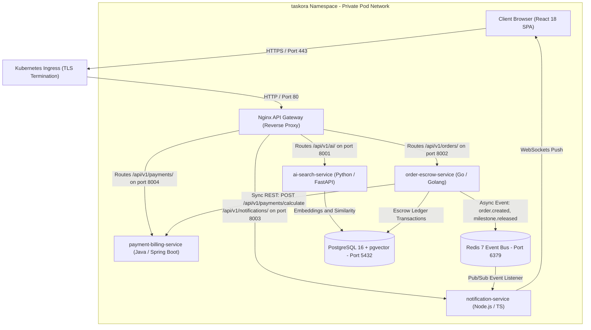

# Taskora — Specialized Microservices Marketplace Platform

> **"Big results. One task at a time."**

Taskora is a complex, production-grade microservices marketplace platform connecting clients, developers, agencies, creators, and specialized digital service providers. It combines the functional depth of a large ecommerce marketplace, the dynamic discovery experience of a social platform, and the workflow capabilities of a professional services workspace.

---

## Polyglot Microservices Architecture

The platform's backend is architected across multiple programming languages, each chosen for its domain strengths:

| Microservice | Language & Framework | Primary Responsibility | Port | Directory |
|---|---|---|---|---|
| **AI & Semantic Search** | **Python** (FastAPI, Pydantic, Uvicorn) | Natural language search queries, vector similarity, and AI assistant | `8001` | [`services/ai-search-service`](./services/ai-search-service) |
| **Order & Escrow Service** | **Go / Golang** (`net/http`, Goroutines) | High-throughput order placement, escrow balance locking & milestone release | `8002` | [`services/order-escrow-service`](./services/order-escrow-service) |
| **Notification Service** | **Node.js & TypeScript** (Native HTTP, WebSockets) | Real-time event pub/sub, live chat notifications, and delivery alerts | `8003` | [`services/notification-service`](./services/notification-service) |
| **Payment & Billing Service** | **Java** (Spring Boot 3, Spring Actuator) | PCI-compliant calculations, tax/VAT estimation, coupon validation & invoices | `8004` | [`services/payment-billing-service`](./services/payment-billing-service) |
| **API Gateway** | **Nginx** (Reverse Proxy & Ingress) | Unified routing, rate limiting, and CORS headers | `8080` | [`services/api-gateway`](./services/api-gateway) |

---

## 🛠️ DevOps Engineer Guide: Service-to-Service Connectivity & Architecture

This guide explains how services connect to each other, how traffic is routed and secured, and how failures are mitigated in production.

### 1. Inter-Service Communication Topology



### 2. Service Discovery & DNS Resolution

Microservices never use hardcoded IP addresses. They resolve each other via internal DNS:

- **In Kubernetes (Production)**:
  Uses Kubernetes CoreDNS format: `<service-name>.<namespace>.svc.cluster.local:<port>`
  - Python AI Service: `http://ai-search-service.taskora.svc.cluster.local:8001`
  - Go Order & Escrow: `http://order-escrow-service.taskora.svc.cluster.local:8002`
  - Node.js Notifications: `http://notification-service.taskora.svc.cluster.local:8003`
  - Java Payment Service: `http://payment-billing-service.taskora.svc.cluster.local:8004`
  - Redis: `redis://redis.taskora.svc.cluster.local:6379`
  - PostgreSQL: `postgresql://postgres.taskora.svc.cluster.local:5432/taskoradb`

- **In Docker Compose (Local Dev)**:
  Uses Docker bridge network DNS aliases (`taskora-network`):
  - `http://ai-service:8001`
  - `http://order-service:8002`
  - `http://notification-service:8003`
  - `http://payment-service:8004`
  - `redis:6379`

### 3. Synchronous vs. Asynchronous Communication Matrix

| Source Service | Target Service | Protocol | Pattern | Why? |
|---|---|---|---|---|
| **API Gateway** | **All Microservices** | `HTTP/1.1` & `HTTP/2` | Synchronous Reverse Proxy | Fast path routing, SSL termination, and client CORS handling |
| **Order Service (Go)** | **Payment Service (Java)** | `REST / JSON` | Synchronous Inter-Service RPC | Direct escrow ledger validation and tax computation before locking funds |
| **Order Service (Go)** | **Redis Event Bus** | `RESP` / Pub/Sub | Asynchronous Event Emitter | Decouples order state changes (`milestone.approved`, `refund.processed`) from notifications |
| **Notification Service (Node)** | **Redis Event Bus** | `RESP` / Pub/Sub | Asynchronous Event Consumer | Subscribes to platform events and broadcasts notifications non-blockingly |
| **Notification Service (Node)** | **Client Browser** | `WebSocket (ws://)` | Full-Duplex Persistent Stream | Instant real-time typing indicators, chat messages, and escrow status badges |

### 4. Kubernetes Network Security (`NetworkPolicy`)

To enforce zero-trust security inside the cluster:
- **Default Deny Ingress**: All pods reject outside network traffic by default.
- **Ingress Whitelist**: Only the Nginx API Gateway pod receives external traffic from the Ingress controller.
- **Inter-Service Authorization**: Only the `order-escrow-service` pod is permitted egress to port `8004` on the `payment-billing-service`.
- **Database Isolation**: Direct public access to PostgreSQL and Redis is blocked; only authorized pods within the `taskora` namespace can connect.
- Manifest: [`k8s/network-policy.yaml`](./k8s/network-policy.yaml).

### 5. Distributed Tracing & Correlation IDs

Every inbound client request is tagged at the API Gateway with an `X-Correlation-ID` header:
1. `Client -> Ingress -> API Gateway`: Injects `X-Correlation-ID: req-7b82f0c1`.
2. When the **Go Order Service** calls the **Java Payment Service**, it forwards the `X-Correlation-ID`.
3. When an event is published to Redis, the correlation ID is included in the JSON payload metadata.
4. When logs are collected by FluentBit / Grafana Loki, DevOps can trace a single transaction across all 4 polyglot services with one query:
   ```logql
   {namespace="taskora"} |= "req-7b82f0c1"
   ```

### 6. Resilience, Retries & Circuit Breaking

- **Connection Pooling**: Go and Java microservices utilize bounded connection pools (e.g. HikariCP for Java, `sql.DB.SetMaxOpenConns` for Go) to prevent database exhaustion.
- **Fail-Fast Timeouts**:
  - API Gateway to Microservice: `3.0s` timeout.
  - Go Order Service to Java Payment Service: `2.0s` timeout with 2 exponential backoff retries.
- **Graceful Degradation**: If the `notification-service` is temporarily restarting, order placements and escrow funding **do not fail**; the event is buffered in Redis and delivered once the notification pods pass their readiness checks.

---

## Kubernetes Probes Architecture Guide

In alignment with [`someshtarra/kubernetes-probes-architecture-guide`](./k8s/PROBES_ARCHITECTURE_GUIDE.md), each microservice contains production-grade **Liveness**, **Readiness**, and **Startup Probes**:
- **Python**: Fast liveness probe on `/healthz` and vector indexing readiness probe on `/readyz`.
- **Go**: Sub-millisecond lightweight memory probes (`/healthz` and `/readyz`).
- **Node.js**: Event loop health and memory limit monitoring to prevent OOM kills.
- **Java Spring Boot**: Uses `startupProbe` with Spring Actuator to protect the JVM during cold-start class loading, preventing premature pod restarts.


- **Brand Name**: **Taskora**
- **Tagline**: *"Big results. One task at a time."*
- **Visual Identity**: Geometric high-contrast layout, obsidian dark surfaces with electric indigo (`#6366F1`) & hyper-violet (`#8B5CF6`) accents, mint emerald (`#10B981`) milestone indicators, and amber rating glow. Completely original typography and component design system, avoiding any direct clone of Amazon, Instagram, Fiverr, or Upwork.

---

## Core Capabilities & Screen Architecture

### 1. Global Application Shell & Navigation
- **Header Navigation**: Desktop brand logo, Explore Showcases, 12 Categories Drawer, Marketplace, Projects, Specialist Directory, Direct Messaging (with unread counter), Notifications Center (with category badges), Saved Services, Order Tracking, Role Switcher (Buyer / Specialist / Admin), and Dark/Light mode toggle.
- **Universal Intelligent Search**:
  - Natural Language Intent Parser: Accepts queries such as *"Need an AI chatbot for a Shopify store under $300"* and automatically filters by category, budget constraints, and keywords.
  - Autocomplete & Real-Time Previews (services and specialists).
  - Typo Correction Suggestions (e.g. *kubernetez* → *Kubernetes*).
  - Trending & Recent Search History with single-click repeat and save search bookmarks.

### 2. Home Dashboard
- **Dynamic Hero Section**: Headline *"Everything you need, one microservice at a time."*, value proposition, large search bar with suggestion chips (*Build my website*, *Edit my YouTube videos*, *Automate my business*, etc.).
- **Live Platform Metrics**: Over 24,500 delivered microservices, 99.4% on-time milestone SLA, sub-15 minute average specialist response, and $42M+ escrow protected payouts.
- **Varied Layout Discovery**:
  - *Recommended for You* (high-impact 3-column cards).
  - *AI & Automation* (glowing dark obsidian container with multi-agent cards).
  - *Top Specialists & Creators* (detailed profile cards with skills and verified badges).
  - *Fast Micro-Tasks Under $100* (rapid turnaround tasks).
  - *Enterprise Certified Services* (SLA, SOC2, HIPAA compliance).

### 3. Social Discovery System (Explore Feed)
- Instagram-inspired discovery layer without copying Instagram UI.
- Masonry grid showcasing real-world proofs of work:
  - **Interactive Before & After Comparison Slider**: Live drag comparison of UI/UX redesigns.
  - **Short-Form Video Breakdowns**: Fast-paced breakdown reels with playable video preview overlays.
  - **Case Studies with Hard Metrics**: Displaying real client results (e.g. *78.4% ticket deflection*, *$9,300/mo cloud cost saved*).
  - **Direct Service Connect**: Every post links directly to its parent microservice with starting price, specialist rating, and one-click "View Service".
  - **Social Interactions**: Live likes count, saves, comments drawer with interactive replies, and shareable link generation.

### 4. Marketplace & Advanced Filters
- **12 Disciplines**: Design, Development, AI & Automation, Marketing, Writing, Video, Business, Data, Engineering, Cybersecurity, Cloud, Consulting.
- **Deep Filtering**:
  - Price Range Slider ($50 – $1,500+)
  - Delivery Time Slider (24h to 14 days)
  - Minimum Rating (Any, 4.5+, 4.8+, 4.9+)
  - Provider Tiers (*Rising Talent*, *Pro Specialist*, *Top Rated Plus*, *Enterprise Elite*)
  - Verified Specialists Only
  - Subscription Retainer Available
  - Enterprise Ready
- **View Modes**: Grid View and Compact List View toggle.
- **Sorting Options**: Recommended, Most Popular, Highest Rated, Lowest Price, Highest Price, Fastest Delivery, and New & Rising.

### 5. Service Detail Page
- **Hero & Header**: Breadcrumbs, title, category, ratings, completed orders, and response time.
- **Media Gallery**: High-res screenshots, demo videos, and architecture diagrams.
- **3-Tier Package Architecture**:
  - **Basic**: Scoped entry-level package.
  - **Standard**: Most popular comprehensive delivery tier.
  - **Premium**: Enterprise multi-agent or full-stack package with extended support.
- **Interactive Add-Ons**: Express 24-hour turnaround, custom voice synthesis, extended VIP maintenance, and clean source code.
- **8-Step Service Workflow Tracker**: Transparent visual checkpoints from Requirements Intake to Escrow Sign-off.
- **Reputation & Review System**:
  - Star breakdown bars.
  - Criteria rating: *Communication*, *Quality*, *On-Time Delivery*, *Value*.
  - Verified purchase badges and specialist responses.

### 6. Custom Project System & Transparent Matching
- **Post a Project Workflow**: Title, description, discipline category, budget range ($min - $max), deadline, required skills tags, experience level, and timezone.
- **Transparent Algorithmic Match**: Displays match score (e.g. 98%) with explicit factor breakdown:
  - Overlapping skills tags.
  - Verified past projects in the same technical category.
  - Budget & hourly rate alignment.
  - Response speed SLA.

### 7. Collaborative Project Management Workspace
- **3-Column Interface**:
  - *Left Navigation*: Overview, Milestones, Tasks, Deliverables, Files, Activity.
  - *Main Canvas*: Milestone escrow schedule, Deliverables inspection with **Approve Deliverable** and **Request Revision** feedback workflow, and interactive sprint task checklist.
  - *Right Sidebar*: Contract terms, assigned specialist profile, and escrow vault status.

### 8. Real-Time Messaging & Collaboration
- Direct specialist conversations and project-specific chat threads.
- Typing indicators and live online status indicators.
- Voice note player UI with scrubber and duration.
- Rich attachment cards:
  - Milestone Release Approval Cards.
  - Direct Payment Requests.
  - Encrypted Document & Spec Uploads.
- Message emoji reactions and pinned project notices.

### 9. Freelancer & Client Dashboards
- **Freelancer Studio**: Total earnings ($34,820), available balance, pending funds in escrow, active orders pipeline, microservice listing manager, revenue velocity chart, and bank withdrawal modal.
- **Client Workspace**: Total investment analytics, active escrow balance, visual project status timeline (Phase 1, 2, 3), downloadable tax invoices, and subscription manager.

### 10. Subscription Marketplace (Recurring Retainers)
- Monthly SEO Retainer ($299/mo)
- 24/7 Cloud SRE Infrastructure Monitoring ($199/mo)
- High-Retention Video Channel Management ($499/mo)
- Continuous Web App & Design System Maintenance ($149/mo)
- Quota meters, automatic renewal dates, and instant cancellation modal.

### 11. Platform Admin Operations & Governance
- Platform GMV ($1,420,850) and net revenue telemetries.
- **Dispute Resolution Queue**: Inspect buyer vs. specialist claims, review evidence, and issue client refunds or provider escrow releases.
- **Provider Verification Queue**: Audit identity documents and portfolio links before granting Verified Specialist status.
- **Service Moderation & Fraud Takedown Queue**: Manage flagged listings.

### 12. Realistic Checkout & Payment Architecture
- Itemized pricing: Package price + selected add-ons - coupon discounts + platform fee (5%) + state tax (6%).
- Promotional codes (e.g., `TASKORA10` for 10% off, `LAUNCH25` for $25 off).
- Payment methods: Credit Card (Visa/Mastercard), Apple/Google Pay 1-Click Biometric, Saved Card, and Corporate Net-30 Invoices.
- Escrow guarantee notice and animated confetti celebration on completion.

---

## Technology Stack

- **Framework**: React 18 + TypeScript
- **Bundler**: Vite 6
- **Styling**: Tailwind CSS with custom design tokens and dark mode support
- **Icons**: Lucide React
- **Celebration Effects**: Canvas Confetti

---

## Getting Started

### 1. Install Dependencies
```bash
npm install
```

### 2. Run Development Server
```bash
npm run dev
```
Visit `http://localhost:5173` in your browser.

### 3. Production Build
```bash
npm run build
```
Creates an optimized production bundle in `dist/`.
